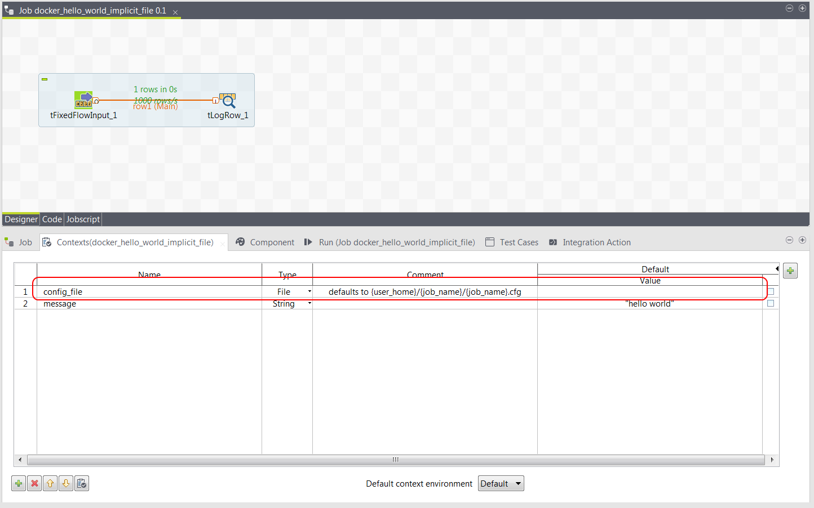
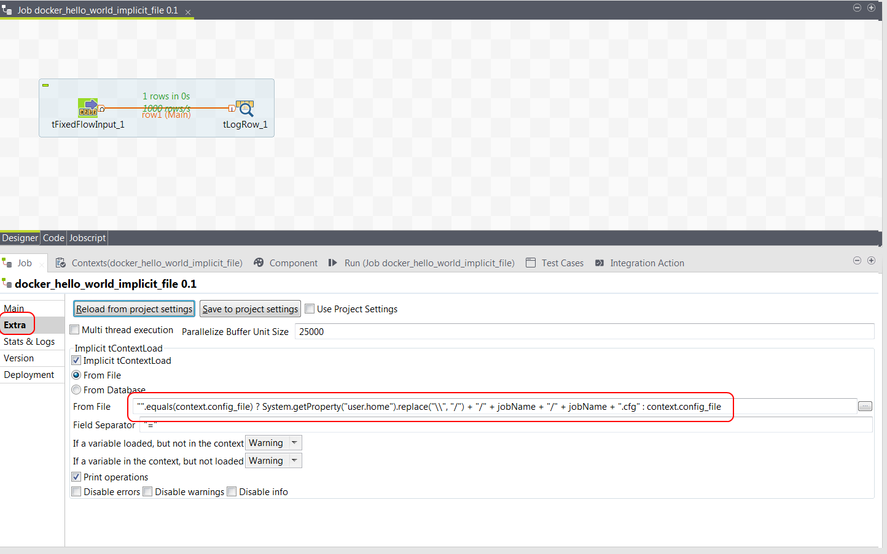

# HelloWorld Configuration Files and Implicit Context Load from File

Passing parameters on the command line is handy, but it is not practical when there are lot of parameters.
A more convenient mechanism is to pass in a single file which in turn holds the parameters.
Talend provides the Implicit Context Load feature to do just this.

The `docker_hello_world_implicit_file` job uses Implicit Context Load to make passing job configuraiton easy.
It is almost identical to the basic `docker_hello_world` job except it uses the Implicit Context Load feature.
You can use `Import Items` to load the job into Studio.

There is a single new context variable `config_file`.



The `config_file` context variable is used in the Implicit Context configuration.  This in in the Extra subtab under the Job tab.



The expression for specifying the file location is just an extended Java expression.

````java
"".equals(context.config_file) ? System.getProperty("user.home").replace("\\", "/") + "/" + jobName + "/" + jobName + ".cfg" : context.config_file
````

First, it checks to see if a config_file parameter has already been provided.
If it has been provided then it uses that file location.
If no config_file parameter has been provided it uses a default value of the user's home directory and then the job name subdirectory.
The config file must exist, otherwise the Implicit Context Load will fail and the job will exit.

Build this job from Studio into the shared folder as shown above so that job2docker creates a container for it.

Confirm the docker image was created.

````
[eost@localhost ~]$ docker images
REPOSITORY                              TAG                 IMAGE ID            CREATED              SIZE
eost/docker_hello_world_implicit_file   0.1                 c624bba57209        About a minute ago   180MB
````

Create a sample config file in $HOME/docker_hello_world_implicit_file/docker_hello_world_implicit_file.cfg

````bash
mkdir -p $HOME/docker_hello_world_implicit_file
cat > $HOME/docker_hello_world_implicit_file/docker_hello_world_implicit_file.cfg <<EOF
message=greetings from mars
EOF
````

The config file now existings on the _hosts_ OS, but it will not be visible to the job running in the container.

````
docker run \
    -v $HOME/docker_hello_world_implicit_file:/talend/config \
    ${USER}/docker_hello_world_implicit_file:0.1 \
    --context_param "config_file=/talend/config/docker_hello_world_implicit_file.cfg"
````

The example above uses a Docker volume mount to map the directory in the host OS to a container directory.
It then uses the volume mount container relative location as the parameter for the entry point.

You should see output similar to the below.

````
log4j:ERROR Could not connect to remote log4j server at [localhost]. We will try again later.
Implicit_Context_Context set key "message" with value "greetings from mars"
Warning: Parameter "config_file" has not been set by Implicit_Context_Context
greetings from mars
````

Notice that the content of the config file has modified the message.
