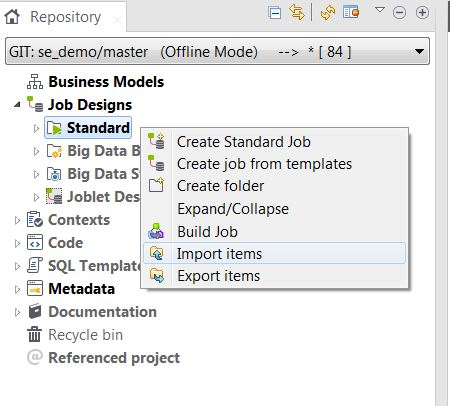
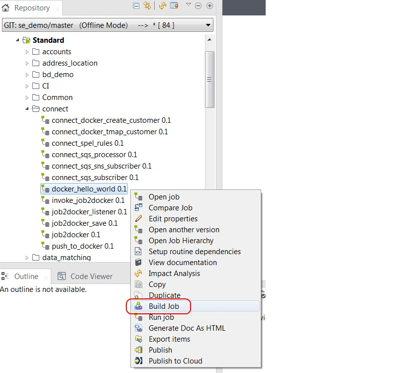

# HelloWorld with Job2Docker

* [Basic HelloWorld Job](#basic-helloworld-job)
    * [Build helloworld job to shared directory](#build-docker-job)
    * [Run helloworld job container](#run-job-in-container)

## Basic HelloWorld Job

### Build Docker Job

The jobs directory includes a simple HelloWorld job.
Both the exported job and the built job are included for reference.
Use the `Import Items` capability to load `docker_hello_world.zip` into Studio.



Use `Build Job` to generate the zip file in the shared directory previously created.



Confirm that the docker image has been built

````
sudo docker images

REPOSITORY                                          TAG                 IMAGE ID            CREATED              SIZE
eost/docker_hello_world                             0.1                 ce044e5cbcb7        About a minute ago   176MB
````

You should see output similar to the [job2docker_listener console](job2docker_listener_console_sample.md)

### Run Job in Container

You can run the HelloWorld job from the container using the Docker run command.

````
docker run ${USER}/docker_hello_world:0.1
log4j:ERROR Could not connect to remote log4j server at [localhost]. We will try again later.
hello world
````
